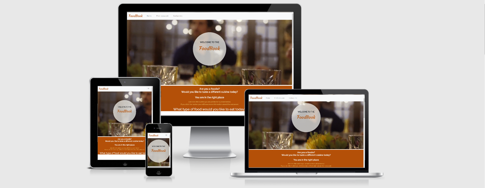
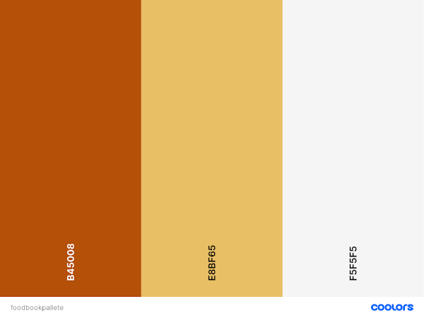

# **FoodBook**

FoodBook is a website which encourages and helps people to choose a different cuisine where ever they are.

This site makes use of the Google Places API to allow filtering restaurants by worlds most known cuisines.

## **User Experience**

 The navigation bar is at the head of the page easily visible, fixed to the top and clear for user to understand. 
 The "Home" button and the logo will take you right back to the landing.   
 "Find restaurant" tab will take you to the cuisines where you can make your interactive selections.   
 "Contact-me" tab will take you to a contact form.    
 In the footer you can see the social links for you to follow me on Social Media in order to get updated information about the website.

#### **User Stories**

As a user I would like  
* to be immediately sure if the website is credible and trustworthy.  
* to have more targeted restaurant options to choose
* to see the relevant information about the restaurants  
* to be able to contact someone when I need to

As a owner I would like
* to make sure users will understand how to interact with the website.
* to make the restaurant selection easier by bringing the google reviews and restaurant rating.  
* to ensure the user can contact me if they see any fault or suggestion to improve the website.

### **Strategy**

I wanted to answer users common questions such as "Is this what I expected to see?", "Does it offer what I want?",
"Is it valuable enough for me to return?". 
For this website I aimed to create an user friendly, intiuitive structure. To do that I tried to create a simple but visually appealing website

### **Scope**

This website scope are those people who are looking for different tastes and want to make well informed choices of restaurants from various world's cuisine.  

### **Structure**

The website is built in one page and three sections; landing, interactive section and contact me section.  
The landing section has the header navigation menu bar which is placed and fixed at the top of the page along with the logo, the bar will follow the user along the page.  
I used the tree structure therefore the menu on the mobile version collapses to the "hamburger" icon made with bootstrap classes.   
There is a short, looped video with an animated box which greets the user as they arrive to the website.  
Next section gives a brief information about what the website offers and how to use it.
"Find restaurant" tab will take you to the main interaction of the website. I wanted to make it clear by highlighting and changing to the pointer cursor when the user hovers over the cuisine images to find the restaurants.
As you click, markers will appear within range of your location which shows the restaurants on the map. When you click the marker of the restaurant you choose, it will
bring a card with the restaurant information including photo, address, rating, webstie and reviews.
"Contact me" section has give some information about myself and a contact form for the user to fill in. A message will be sent and I will recieve it immediately.
Footer has the social links in colors and layout matching with the rest of the website design.  

### **Skeleton**

I tried to give as many information as I can with minimal choices. Navigation has "home", "find restaurant" and "contact me" section.  
The website prototype I have designed is [here](wireframe/FoodBookWireframe.pdf).  
### **Surface**

The colors I used in this project were:  

  

I used Google fonts for the website; font *"Courgette"* for the section titles and logo, font *"Raleway"* for the main content. 

## **Features**
### **Existing Features**

User can
* navigate through the site with Navbar, they can go to finding restaurants or contact me section.
* find their location if the user allows to do so, otherwise it will take London as default. It uses Google Places API to do that.
* choose cuisine by clicking one of the images, this will show the spesific restaurants which serve this cuisine on the map.
* click markers on the map and there will be a card appearing right next to map and revealing information such as address website link and reviews.
* send me a message by filling the contact form. The contact form is sent using EmailJS.

### **Features Left to Implement**
* Filter option to list the restaurants by their rating or prices for user to make better choices depending on their preferences.
* "Add Review " option for user to be more interactive with the site.
* "Order Online" option which will take user to online ordering websites such as "deliveroo", "uber eats" etc.

## **Technologies Used**

  * HTML

  * CSS

  * Javascript 

  * [Bootstrap](https://getbootstrap.com/)

  * [Google Fonts](https://fonts.google.com/) *Courgette*, *Raleway*

  * [Google Places API](https://developers.google.com/places/web-service/intro) to call location, restaurant name, address, raiting, photos, reviews.

  * [Fontawsome](https://fontawesome.com/) for the social links.

  * [Animista](https://animista.net/play/entrances/scale-in/scale-in-top) for the greeting animation.

    
  
## **Testing**
To test the website I have used Google developer tools during and after creating the site to check CSS elements and website responsiveness,  
"console" to see API and function errors, "source" for js function and typing errors and "network" tab to test APIs responding correctly.  
I tested the responsivenes between different mobile devices using Google developer tools. I also tested it in most common browsers such as Chrome, Mozilla,  
Safari, Opera.  
I tested my html code with [W3C HTML Validator](https://validator.w3.org/). I fixed the erros and warnings accordingly.  
I tested my CSS code with [W3C CSS Validator](https://jigsaw.w3.org/css-validator/).I fixed the errors and warnings accordingly.
I tested my Javascript code with [JSHint](https://jshint.com/) there was typing error such as missing semicolon and undefined variables, these were also fixed accordingly.

## **Deployment**

In order to deploy the repository from GitHub I follow these steps.
1. From GitHub repositories dashboard I selected "FoodBook".
2. I went to Settings and "GitHub Pages" heading.
3. I chose the "master branch" option from the "source" dropdown menu.
4. This action refreshed the page and a ribbon appeared saying "Your site is published at  (https://ozluna.github.io/FoodBook/ ) with the the live link which indicated me that deployment was successful.

#### To run locally:
Save a copy of the github repository located at https://github.com/ozluna/FoodBook by clicking the "download zip" button at the top of the page and extracting the zip file to your chosen folder.  
If you have Git installed on your system, you can clone the repository with the following steps:  

* Open Git Bash.

* Change the current working directory to the location where you want the cloned directory.

* Type git clone, and then paste the URL you copied earlier.

  `git clone https://github.com/ozluna/FoodBook`  

* Press Enter to create your local clone.

## **Credits**
I used Google Places Documentation and [codelabs developers](https://codelabs.developers.google.com/) when I created the code to find the user's location 
script and I found some help on "stackoverflow" for the script to call the reviews.  SendEmail function was created with help of documentation from EmailJs and code institute lessons.  

All the images are created on [Canva](https://www.canva.com/)  
Social link icons are taken from [Fontawsome](https://fontawesome.com/)  
Animation on the greeting is from [Animista](https://animista.net/)  
For responsiveness I used [Boostrap](https://getbootstrap.com/)  
For fonts I used [Google Fonts](https://fonts.google.com/)  

## **Acknowledgements**

In the process of finishing this website I used many resources mainly, Google Places documentation, MDN web docs, W3Schools, Stack Overflow.  
Youtube channels such as Travers media, online resources [goalkicker](https://goalkicker.com), code institute videos and last but not least my mentor and tutors help.

